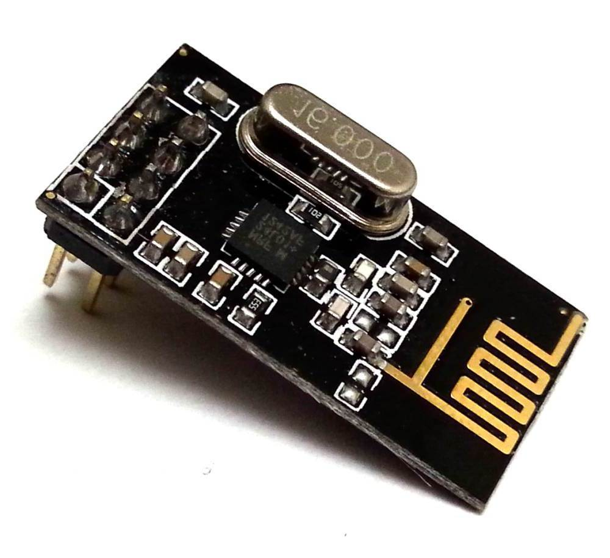
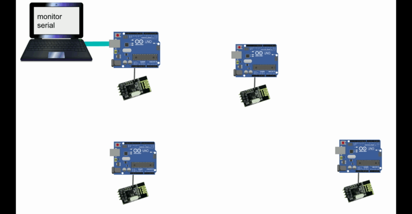
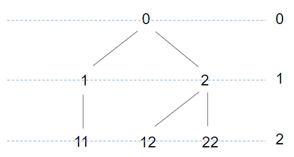
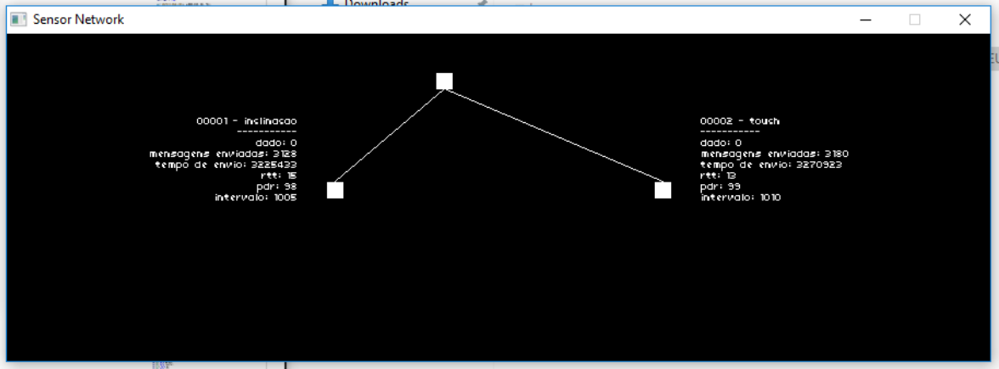
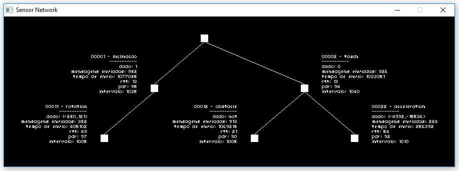

# Rede de sensores

 

O projeto tem como objetivo implementar uma rede de sensores utilizando tranceptores nRF24l01+. São utilizados cinco nós *senders* e um sorvedouro, que recebe todas as informações e as envia via serial (USART). O nó sorvedouro também é responsável por configurar o intervalo de transmissão das mensagens enviadas pelos nós *senders*.

A rede também deve implementar multiplos saltos, permitindo que sensores fora do alcance do sorvedouro possam participar da rede.

Por fim, como último requisito, os dados enviados pelo nó sorvedouro via serial devem ser utilizados por uma aplição "desktop" para exibir a topologia atual da rede e apresentar os conteúdos recebidos. 

## RF24Network

 

A biblioteca [RF24Network](https://tmrh20.github.io/RF24Network/) implementa a camada de rede do modelo OSI utilizando transceptores nRF24L01+. Oferece fragmentação e reconstrução de pacotes, transmissão de dados via múltiplos saltos, roteamento automático e organiza seus nós em uma topologia de árvore. Cada nó pode se comunicar com até cinco filhos (devido à limitação do próprio transceptor, que só pode se comunicar com até seis nós), e a árvore possui altura máxima igual a cinco, totalizando 781 nós.

Cada nó deve receber um endereço composto de no máximo quatro dígitos, de 1 a 5. Conforme mostra a figura ao lado, a quantidade de dígitos reflete o nível em que o nó se encontra na árvore, o primeiro dígito informa qual seu índice como filho, e os últimos, qual o endereço de seu nó pai. 31, por exemplo é o terceiro filho do nó, e está no nível 2 da árvore.  

## Endereçamento
- **Via serial:** quando um nó é ligado, ele aguarda 10 segundos o recebimento de algum endereço via serial. O endereço informado é gravado na EEPROM;
- **Via EEPROM:** caso nenhum endereço seja inserido, tenta-se obter o último endereço gravado na EEPROM;
- **Via código:** caso não se consiga obter um endereço válido da EEPROM, o endereço inserido via código é utilizado.

## Payload e Sender
Códigos repetitivos foram encapsulados em duas bibliotecas: a Payload, que fornece a estrutura do pacote, e a Sender, que armazena métodos comuns a todos os nós sensores (todos os nós menos o sorvedouro).

Um pacote armazena as seguintes informações:
 - momento de envio do pacote;
 - contador;
 - tempo de resposta em millisegundos;
 - taxa de entrega (pacotes recebidos / enviados);
 - taxa de envio em millisegundos;
 - tipo de sensor;
 - valor do sensor.

## Aplicação desktop
Desenvolvida em [pico-Céu](https://github.com/ceu-lang/pico-ceu), a aplicação desktop apresenta, em tempo real, a árvore de sensores e o conteúdo dos últimos pacotes enviados. A aplicação admite o uso somente dos endereços: 1, 2, 11, 12, 22. Uma proposta para trabalhos futuros seria aumentar a quantidade de endereços adminitos pela árvore ou, ainda, utilizar uma estratégia mais genérica, adimitindo o uso de qualquer endereço, limitando, talvez, somente a quantidade de nós.

;
;

## Equipamentos
- 6 x nRF24l01+
- 6 Arduinos UNO
- 5 sensores
  - sensor de inclinação com chave de mercúrio;
  - sensor touch capacitivo;
  - sensor de obstáculo infravermelho;
  - 2x sensor de movimento / giroscópio.

## Integrantes
- [Anny Caroline](https://github.com/AnnyCaroline/)
- [Wellington](https://github.com/wellington34226)

## Apresentação
- [apresentação](https://docs.google.com/presentation/d/1lwsjdhIuiyjNCqPYpRjfqGPr3z3zVVWdjU5c1WbAfAQ/edit?usp=sharing)

## Vídeo
- ToDo

