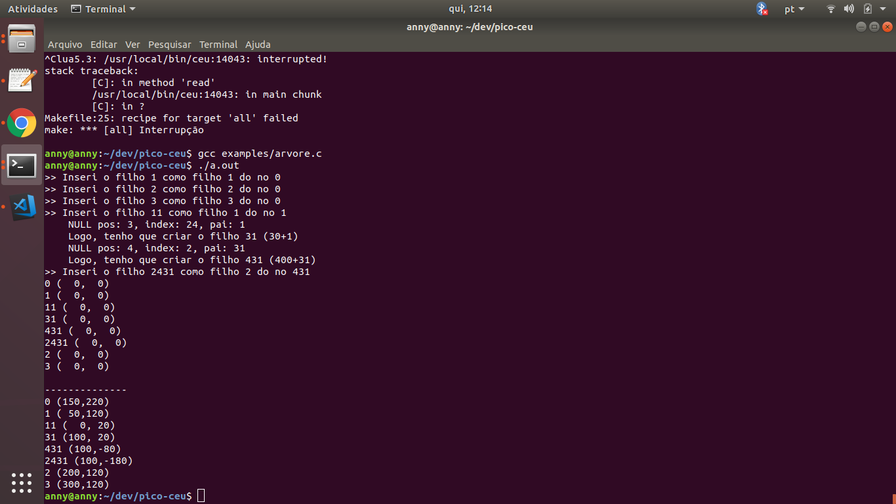

# Aplicação Master Desktop

Desenvolvida em , a aplicação Master Desktop exibe a topologia atual da árvore de sensores gerada pela biblioteca nRF24Network assim como os conteúdos dos pacotes enviados, como RTT e dado do sensor.

O arquivo ```sensorNetworkStatic.ceu``` utiliza somente a linguagem Céu e exibe uma árvore estática. Tentou-se desenvolver uma abordagem dinâmica utilizando somente a linguagem Céu (arquivo ```sensorNetwork```, mas enfrentamos problemas no uso de recursões). A solução escolhida foi utilizar um misto entre as linguagens C e Céu.

O arquivo ```arvore.c``` apresenta os primeiros passos para essa solução, que inclui a criação e inserção dos nós na árvore dinamicamente.


